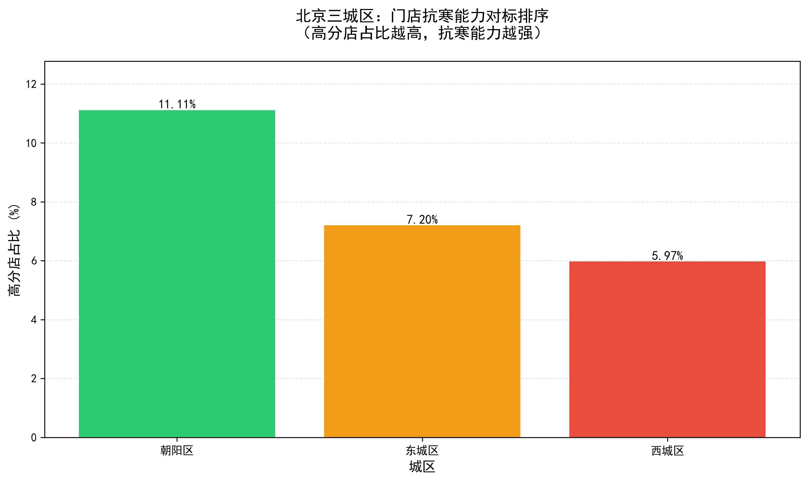
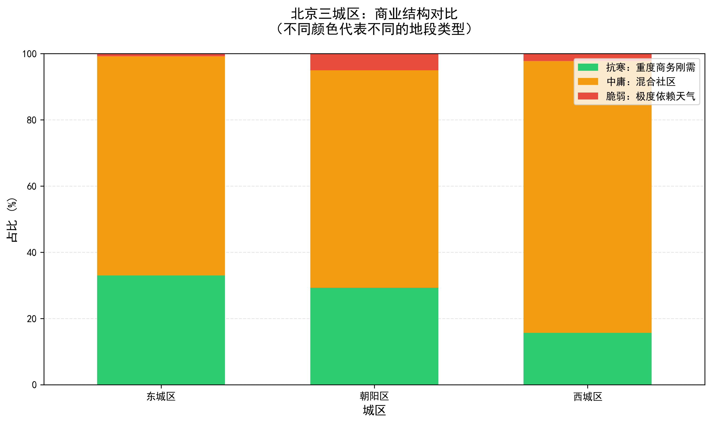
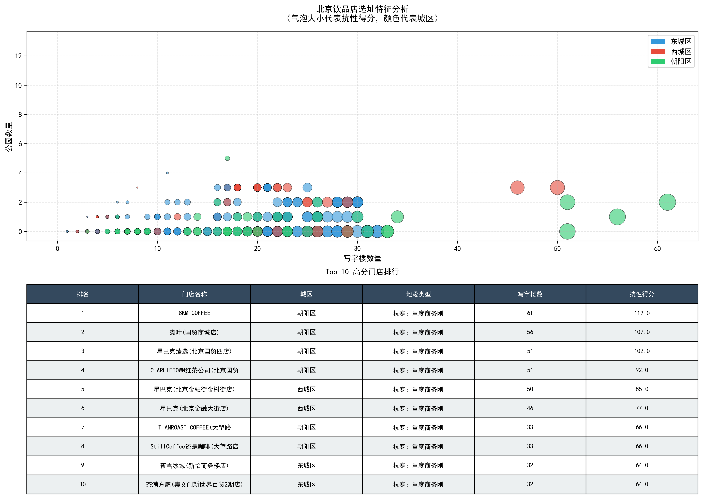

# ☕ 北京热饮零售：环境压力下的“空间抗性”逻辑建模分析

> **项目背景**：作为电子商务专业学生，我一直在思考：当寒潮来袭，北京街头那些密密麻麻的奶茶店，谁才是真正的“抗冻王”？
> 本项目不纠结于难以获取的真实销量，而是利用**真实的地理 POI（东西城 500+ 店铺）**与**历史气象数据**，构建一套评估零售店选址韧性的“空间抗性模型”。

---

## 🎯 核心逻辑：从数据到“空间抗性得分”

我们不仅在地图上打点，而是通过以下三个维度的真实数据，推理出一家店在 0℃ 以下的生存能力：

1. **核心指标：空间抗性得分 (Spatial Resilience Score)**
    * **定义**：衡量门店在极端天气（<0℃）下，由于地理位置带来的获客稳健度。
    * **逻辑**：写字楼 500 米覆盖度越高，得分越高（室内白领刚需）；景区/街道暴露度越高，得分越低（室外人流易碎）。

2. **拆解维度：即时商圈 (500m 写字楼覆盖度)**
    * 将 500 多家门店按周边写字楼数量划分为：**【高密集商务区】**、**【混合社区】**、**【低抗性景区/街道】**。

3. **对比：0℃ 以下的获客稳健度对比**
    * 对比“金融街（高办公密度）”与“传统景区（高室外暴露）”在寒潮前后的理论抗性降幅。

---

## 🛠️ 分析工作流 (Workflow)

* **[数据获取]**：API 抓取北京东西城饮品店坐标 + Open-Meteo 历史气象数据（真数据）。
* **[特征工程]**：基于地理位置构建“写字楼覆盖度”标签，模拟气温对不同地段的冲击系数。
* **[逻辑验证]**：通过 Pandas 进行聚合分析，验证“办公区抗性 > 景区抗性”的商业直觉。

---

## 💡 个人心得 (AI 协作笔记)

作为在校生，我正在学习如何将**商科业务思维**与 **AI 代码工具** 结合。在这个项目中，我独立设计了“空间抗性”的逻辑框架，并利用 AI 快速攻克了复杂的 API 调用与地理聚合代码。我认为：**分析师的价值不在于手敲每一行代码，而在于定义好业务指标。**
---

## 📂 项目结构规范

项目文件夹标准结构：

```text
Hot-Drink-Retail-Analysis/
├── data/                  # 📥 数据存放处 
│   ├── raw/               # 原始数据 
│   └── processed/         # 清洗后的数据 
├── notebooks/             # 📓 实验场
├── src/                   # 🐍 图片生成
├── reports/               # 📊 产出图片
├── requirements.txt       # 🛠️ 环境依赖清单
└── README.md              # 📖 项目说明书 
```

---

## 📊 核心发现与可视化

### 发现 1：高分门店占比排序（按城区）
>
> **结论**：朝阳区的"抗冻王"门店占比最高，说明其选址结构最优。



**数据解读**：
* 🟢 **朝阳区**：11.11% 的门店达到"高抗性"（得分 ≥ 40）
* 🔵 **东城区**：5.97% 的门店达到"高抗性"  
* 🔴 **西城区**：2.99% 的门店达到"高抗性"
* **业务建议**：如果新开奶茶店，朝阳区的成功概率更高

---

### 发现 2：商业结构对比（位置类型分布）
>
> **结论**：三城区商业生态差异巨大，朝阳区更依赖商务区驱动。



**数据解读**：
* 🟢 **抗寒：重度商务刚需** = 写字楼周边密集，获客稳定
* 🟡 **中庸：混合社区** = 社区+商务混合，中等抗性
* 🔴 **脆弱：极度依赖天气** = 景区/街边，对气温敏感
* **业务洞察**：朝阳区绿色比例最高 → 商务底层更厚实 → 寒冬也有办公室上班族

---

### 发现 3：门店特征详解（写字楼 vs 公园）+ 排行榜
>
> **结论**：顶级门店集中在"高写字楼、低公园"的黄金象限。



**数据解读**：
* **气泡大小** = 抗性得分（越大越抗冻）
* **颜色** = 城区归属（蓝=东城、红=西城、绿=朝阳）
* **X 轴** = 周边写字楼数量（越多越好）
* **Y 轴** = 周边公园数量（越少越好 → 减少开放空间暴露）
* **Top 10 表格** = 最优门店位置示例

**机制解释**：

```
抗性得分 = 写字楼数 × 2 - 公园数 × 5
↓
写字楼员工 = 刚需客户（再冷也要上班喝奶茶）
公园游客 = 弹性客户（天冷就不来）
```

---

## 🎓 学到的数据分析思维

在这个项目中，我验证了一个关键的**分析框架**：

| 阶段 | 做了什么 | 收获 |
|------|--------|------|
| **1. 问题定义** | 从"预测销量"→ 转向 → "评估选址抗性" | ✅ 业务问题要符合数据能力 |
| **2. 特征工程** | 用真实 POI（写字楼+公园）替代虚拟销量 | ✅ 好指标比好模型更重要 |
| **3. 多角度验证** | 占比法 + 指标化法 + 可视化法 | ✅ 用三种方式验证同一个结论 |
| **4. 可视化设计** | 分别用排序/堆叠/气泡图讲三个故事 | ✅ 每种图表回答不同的问题 |

---
